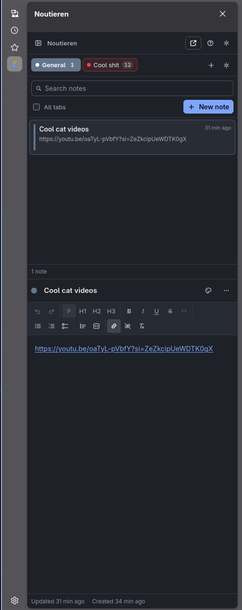
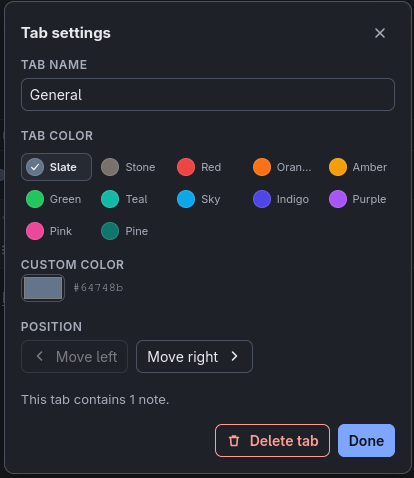
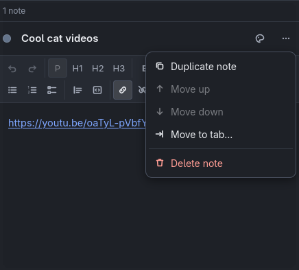

# Noutieren

**Private, local-first notes in the Firefox sidebar, organized into color-labeled tabs.**

Rich text, instant local search, and JSON backups — with no account, no sync, no telemetry,
and no network requests of any kind. Two permissions: `storage` and `unlimitedStorage`.

It lives in the sidebar, and opens in a full browser tab when you want more room.

<p align="center">
  
</p>

| At a glance    |                                                                     |
| -------------- | ------------------------------------------------------------------- |
| **Status**     | Working, signed, in daily use. Not published to addons.mozilla.org. |
| **Requires**   | Firefox 142+ (desktop)                                              |
| **Built with** | React · TypeScript · Vite · Tiptap/ProseMirror · Dexie/IndexedDB    |
| **Tests**      | 203, plus typecheck, lint, a build audit and `web-ext lint`         |
| **License**    | MIT                                                                 |
| **Privacy**    | No data collected — see [PRIVACY.md](PRIVACY.md)                    |
| **Building**   | Reproducible build steps in [BUILDING.md](BUILDING.md)              |
| **Changes**    | [CHANGELOG.md](CHANGELOG.md)                                        |

### Quick start

```bash
npm install
npm run build        # unpacked extension in dist/
npm run firefox      # or: load dist/manifest.json via about:debugging
```

Full install options, including permanent installation, are under
[Installing permanently](#installing-permanently-signing).

### Contents

- [Features](#features) · [Privacy](#privacy) · [Requirements](#requirements)
- [Install](#install-dependencies) · [Development](#run-in-development) · [Build](#build) · [Package](#package-with-web-ext)
- [Installing permanently](#installing-permanently-signing) · [Keyboard shortcuts](#keyboard-shortcuts)
- [Data storage](#data-storage) · [Renaming and identifiers](#renaming-and-identifiers) · [Re-signing](#making-changes-and-re-signing)
- [Export and import](#export-and-import) · [Project structure](#project-structure) · [Testing](#testing-and-checks) · [Known limitations](#known-limitations)

## Features

- **Color-labeled tabs.** Any number of tabs, each with its own name and color, reorderable,
  with a note count. Selected tabs are filled with their own color using a foreground chosen
  for contrast, never text dropped onto an arbitrary background.
- **Notes in every tab.** No limit beyond your disk. Each note has its own title, color,
  position, last-updated time and plain-text preview.
- **Rich text** via Tiptap/ProseMirror: bold, italic, underline, strikethrough, paragraph,
  headings 1–3, bulleted, numbered and check lists, block quotes, inline code, code blocks,
  links, undo/redo and clear formatting. Toolbar buttons show active state, disable when
  unavailable, and keep your text selection.
- **Autosave.** Debounced ~400 ms, flushed immediately on note switch, blur, tab hide,
  window unload and Ctrl/Cmd+S, with a `Saving…` / `Saved` indicator.
- **Local search** over note titles and text, in the current tab or across all tabs.
- **Backup.** Export everything to one readable JSON file; import it back by replacing or
  merging; reset to a clean slate.
- **Light, dark and system themes**, keyboard navigation throughout, and a layout that works
  from a 320 px sidebar to a full window.

## Screenshots

| Tab settings                                                                                                                                                                                                                                            | Note actions                                                                                                                                                             |
| ------------------------------------------------------------------------------------------------------------------------------------------------------------------------------------------------------------------------------------------------------- | ------------------------------------------------------------------------------------------------------------------------------------------------------------------------ |
|  |  |

Selection is never signalled by color alone — the chosen swatch carries a check mark and the
value is printed as text. Controls that cannot act are disabled rather than hidden.

## Privacy

- No network requests. No analytics, telemetry, ads, accounts, or cloud sync.
- No content scripts, no host permissions, no page-reading permissions. The extension cannot
  see any web page you visit.
- Only two permissions are requested: `storage` and `unlimitedStorage`.
- All code and dependencies are bundled locally. The build is verified to contain no remote
  scripts, styles, fonts or `eval`-style dynamic code.
- Your notes live in this Firefox profile's IndexedDB. Deleting the extension's data or the
  profile deletes the notes.

## Requirements

- **Firefox 142 or newer** (the manifest declares `strict_min_version: 142.0`).
- **Node.js 22 or newer** for development. An `.nvmrc` is included:

  ```bash
  nvm use
  ```

## Install dependencies

```bash
npm install
```

## Run in development

For fast UI iteration in a normal browser tab (Vite dev server, hot reload):

```bash
npm run dev
```

Outside an extension context the WebExtension APIs are absent, so the sidebar-specific
buttons fall back gracefully and preferences use a local fallback store. To exercise the real
extension, load it in Firefox:

```bash
npm run firefox
```

This builds `dist/` and launches a temporary Firefox profile with the extension installed and
auto-reloading on source changes.

## Temporary installation through about:debugging

```bash
npm run build
```

Then, in Firefox:

1. Open `about:debugging#/runtime/this-firefox`.
2. Choose **Load Temporary Add-on…**.
3. Select `dist/manifest.json`.
4. Click the Noutieren toolbar button to open the sidebar. If the toolbar button is
   hidden, find it in the toolbar overflow (**»**) menu, or open the sidebar from
   **View → Sidebar → Noutieren**.

A temporary add-on is removed when Firefox closes. Your notes survive, because they are
stored per extension ID in the profile.

## Build

```bash
npm run build
```

Produces the complete unpacked extension in **`dist/`**, with `dist/manifest.json` at its
root. The build runs four steps: generating the PNG icons, bundling the UI, bundling the
background script, and then auditing the output (`scripts/verify-build.mjs`) for missing
files, source maps, remote references and dynamic code.

## Package with web-ext

```bash
npm run package
```

Creates **`web-ext-artifacts/noutieren-1.2.0.zip`** (about 237 KB). Source maps are
excluded and no development files are included.

## Installing permanently (signing)

Firefox will not permanently install an unsigned extension in the release or beta channels.
To install this build permanently you need one of:

- **Sign it through addons.mozilla.org (AMO).** Submit the zip from `npm run package` to
  <https://addons.mozilla.org/developers/> as an unlisted add-on, or run
  `npx web-ext sign --api-key=… --api-secret=… --channel=unlisted --source-dir dist`
  with credentials from <https://addons.mozilla.org/developers/addon/api/key/>. That yields a
  signed `.xpi` you can install from `about:addons` → gear icon → **Install Add-on From File…**.
- **Or use Firefox Developer Edition, Nightly, or ESR**, where setting
  `xpinstall.signatures.required` to `false` in `about:config` permits unsigned installs.
- **Or reload it as a temporary add-on** each session, as described above.

The extension ID is `colornote-tabs@local.extension`. It keeps its pre-rename spelling
deliberately — see _Renaming and identifiers_ below.

## Keyboard shortcuts

| Keys                   | Action                                      |
| ---------------------- | ------------------------------------------- |
| `Ctrl/Cmd + N`         | New note in the current tab                 |
| `Ctrl/Cmd + Shift + N` | New tab                                     |
| `Ctrl/Cmd + K`         | Focus the search box                        |
| `Ctrl/Cmd + S`         | Write pending changes immediately           |
| `Escape`               | Close the open dialog or menu               |
| `Ctrl/Cmd + B / I / U` | Bold / italic / underline                   |
| `Ctrl/Cmd + Shift + S` | Strikethrough                               |
| `Ctrl/Cmd + E`         | Inline code                                 |
| `Ctrl/Cmd + Z`         | Undo                                        |
| `Ctrl/Cmd + Shift + Z` | Redo                                        |
| `← / →`, `Home`/`End`  | Move between tabs, then `Enter` to open one |

The same list is available in the app from the **?** button.

Firefox reserves some shortcuts for itself; depending on your platform and focus, `Ctrl+N`
may open a browser window instead of a note. The **New note** button always works.

## Data storage

- **IndexedDB** (`colornote-tabs` database — see _Renaming and identifiers_) holds tabs, note metadata and rich-text
  documents. Notes are split across two tables — `notes` for metadata and `contents` for
  documents — so listing, previewing and searching never deserialise a single editor
  document. Indexes exist for notes by tab, notes by tab and position, notes by updated time,
  and tabs by position.
- **`browser.storage.local`** holds only small UI preferences: selected tab and note,
  collapsed panel, theme and search scope.
- `unlimitedStorage` is requested so notes are not capped by the default extension quota.
- The schema is versioned (`SCHEMA_VERSION` in `src/database/db.ts`) with Dexie migrations, so
  future changes upgrade existing data instead of discarding it. To add one, append a new
  `this.version(n)` block with an `.upgrade()` handler — never edit an existing block.

Two open views (sidebar and full page) work on the same data and update live. Each save
carries the version it was based on: if the other view wrote first, the save is refused and
you are asked which version to keep, rather than one silently overwriting the other.

## Renaming and identifiers

The product name is display text and can be changed freely: the manifest `name` and titles,
the header in the app, the backup filename prefix, and `APPLICATION_NAME`. Import deliberately
does not check what a backup calls itself, so files exported under an older name still load
(there is a test for exactly that).

Two values are **storage identities and must not be changed casually.** Both still read
`colornote-tabs`, from before the extension was renamed to Noutieren:

| Value                                           | Why it is frozen                                                                                                                                                   |
| ----------------------------------------------- | ------------------------------------------------------------------------------------------------------------------------------------------------------------------ |
| `browser_specific_settings.gecko.id` (manifest) | Firefox maps the extension ID to the `moz-extension://` UUID that owns the database. A new ID means a new, empty origin — and AMO treats it as a brand-new add-on. |
| `DATABASE_NAME` (`src/database/db.ts`)          | Names the IndexedDB database itself. Changing it opens a different, empty one.                                                                                     |

Changing either makes every existing note appear to vanish. If one ever has to change, ship a
migration that copies the old data across, or require users to export first and import after.

## Making changes and re-signing

Any change to the packaged files invalidates the AMO signature, so shipping an update means:

1. Edit the source.
2. Bump `version` in `public/manifest.json` — AMO rejects a version number it has already seen.
3. `npm run check` (typecheck, lint, tests, build, extension lint).
4. `npx web-ext sign --source-dir dist --channel=unlisted` with your API credentials in
   `WEB_EXT_API_KEY` / `WEB_EXT_API_SECRET`.
5. Install the new `.xpi` over the old one. Because the extension ID is unchanged, it upgrades
   in place and keeps existing notes.

## Export and import

**Export** (settings menu → _Export all data…_) writes one readable JSON file named
`noutieren-backup-YYYY-MM-DD.json`, containing the application name, format version,
export timestamp, schema version, every tab, every note (with its document, color, position
and timestamps) and your preferences.

**Import** (settings menu → _Import data…_) parses and validates the file before touching the
database. It checks ids, tab references, colors, positions, timestamps and editor content,
rejects files it cannot read with a specific reason, and rebuilds every document from an
allowlist so nothing in a file can become executable markup. Then you choose:

- **Merge** — keeps your current notes and adds the imported ones, giving new ids to anything
  that would collide and repairing references so imported notes stay with their imported tabs.
- **Replace** — deletes current data first. A safety backup of your existing data is
  downloaded automatically before anything is removed.

**Reset** (settings menu → _Reset all data…_) deletes everything after an explicit
confirmation and recreates the default `General` tab.

## Project structure

```text
public/
  manifest.json          MV3 manifest (action, sidebar_action, background, CSP)
  icons/                 PNG icons generated by scripts/generate-icons.mjs
scripts/
  generate-icons.mjs     Draws and encodes the icons with only Node's zlib
  verify-build.mjs       Audits dist/ for completeness and self-containment
src/
  app/                   Entry point, bootstrap, shell, error boundary, workspace state
  background/            Event page: toolbar click opens the sidebar
  components/            Tab strip, notes panel, editor pane, dialogs, menus, toasts
  database/              Dexie schema and migrations, tab and note repositories
  editor/                Tiptap setup, toolbar, plain-text extraction, import sanitizer
  hooks/                 Contexts, autosave status, theme, shortcuts, list windowing
  services/              Autosave queue, preferences, backup, workspace, errors, WebExt API
  styles/                One stylesheet, custom properties, light/dark, container queries
  types/                 Shared types and the `browser` namespace declaration
tests/                   Vitest suites (fake-indexeddb + React Testing Library)
```

Components never touch IndexedDB directly; all access goes through the repositories in
`src/database/` and the services in `src/services/`.

## Testing and checks

```bash
npm run test        # Vitest in watch mode
npm run test:run    # single run
npm run typecheck   # tsc --noEmit, strict
npm run lint        # ESLint (type-aware) + Prettier check
npm run webext:lint # web-ext lint against dist/
npm run check       # typecheck + lint + tests + build + web-ext lint
```

186 tests cover creating, renaming, recoloring, reordering and deleting tabs; creating,
moving, duplicating, reordering, deleting and restoring notes; autosave debouncing, flushing
on note switch, and the guarantee that one note never receives another's content; storage
failures keeping typed text; conflict detection between views; search within one tab and
across all tabs; export format; valid, invalid and merging imports; import sanitizing; reset;
the v1→v2 database migration; selection restore; keyboard shortcuts; and WCAG AA contrast for
every palette color.

## Known limitations

- **`web-ext lint` reports four `UNSAFE_VAR_ASSIGNMENT` warnings** (0 errors). All four are
  `innerHTML` assignments inside bundled React and ProseMirror code — React's
  `dangerouslySetInnerHTML` support, its `<script>` element creation path, ProseMirror's
  clipboard serialiser, and Tiptap's stylesheet injector. The last one never executes: the
  editor is created with `injectCSS: false` and those rules ship as static CSS instead. The
  remaining three cannot be removed without patching the libraries.
- **Search is a substring scan** over locally stored note metadata, not an inverted index. It
  is comfortable into the low thousands of notes; a much larger collection would want a real
  index.
- **Note reordering uses menu commands** (_Move up_ / _Move down_), not drag and drop, which
  keeps it fully keyboard accessible. Tabs reorder from the tab settings dialog.
- **New notes are appended** to the end of a tab, which keeps creation O(1) rather than
  renumbering every row in the tab.
- **Selection is not mirrored between views.** Two windows can sit on different notes on
  purpose; only the theme follows across views.
- **`Ctrl+N` may be intercepted by Firefox** before the extension sees it, depending on
  platform and focus.
- **Firefox for Android is not supported** — it has no extension sidebar.
- **The bundle is a single ~750 KiB file** (~235 KiB gzipped): React, ProseMirror and Dexie.
  Code splitting would add nothing, since everything loads from local files.

## License

MIT
